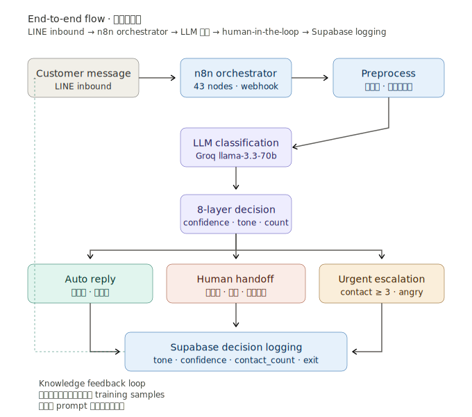

# 物流客服 AI 系統 — Design Documentation

物流客服場景下，以 n8n 為 central orchestrator、Groq llama-3.3-70b 為 classification engine、Supabase 為 decision logging layer 的 AI 客服分流系統設計。

> 此 repo 為 portfolio 用途，呈現系統設計理念與工程取捨。實作細節（n8n workflow JSON、prompt 全文、internal API endpoint、資料 schema）不在此處公開。

---

## System Overview

每天客服收到的 LINE 訊息中，相當高比例屬於可結構化回答的查詢（追蹤碼狀態、預計到貨、配送異常）。傳統做法是全部進人工佇列，造成兩個問題：

1. 客服資源被低複雜度問題吃滿，需要判斷的客訴反而排隊
2. 客戶平均等待回覆時間長，重複聯絡率上升

這個系統的設計目標不是「讓 AI 取代客服」，而是 **讓 AI 處理可預測的高頻低風險訊息，把客服資源留給需要人類判斷的 edge case**。核心設計原則是 **Fail to Safety**：每一道判斷 gate 失敗時，預設導向人工而非繼續自動化。

### 量化規模

| 維度 | 數字 |
|---|---|
| n8n 節點數 | 43 |
| Decision layer gate 數 | 8 |
| LLM 回傳結構化欄位 | 6 |
| 平均 LLM inference latency | ~0.5 秒 |
| 客戶 session window | 72 小時 |

---

## Demo Scope

This repository is a **sanitized design walkthrough**, not a public runnable
demo. It is intended to let a reviewer understand the architecture, decision
logic, failure handling, and implementation shape without exposing production
credentials, customer data, prompt text, webhook URLs, or internal logistics
system schema
details.

What can be reviewed here:

- End-to-end message flow from LINE inbound to Supabase logging
- 8-layer auto-reply / human-handoff / urgent-escalation decision logic
- Integration boundaries for LINE, Groq, internal logistics systems, Supabase,
  and the management UI
- Functional split of the 43-node n8n workflow
- Workflow topology and failure-safe routing rationale

What is intentionally not included:

- n8n workflow JSON exports
- Prompt full text and private few-shot examples
- Internal API endpoints, credentials, webhook hosts, and database schema names
- Customer messages, tracking IDs, or other operational data

If implementation verification is required, the practical review path is a
screen share of the n8n UI, a LINE test message, the resulting Supabase decision
row, and the agent / manager panel state after routing.

---

## Documentation Index

| # | 文件 | 對應問題 |
|---|---|---|
| 01 | [End-to-end overview](docs/01-overview.md) | 一個客戶訊息從進入到回覆，經過哪些階段？ |
| 02 | [8-layer decision logic](docs/02-decision-tree.md) | 系統怎麼決定要自動回覆還是轉人工？ |
| 03 | [Integration architecture](docs/03-integration.md) | 系統跟外部世界（LINE、LLM、DB）怎麼接？ |
| 04 | [Functional blocks](docs/04-functional-blocks.md) | 43 個節點怎麼分工？ |
| 05 | [Workflow topology](docs/05-workflow-topology.md) | 實際的節點連接長什麼樣子？ |

---

## End-to-End Flow

LINE 客戶訊息進入後，由 n8n 接收並走 preprocessing（追蹤碼擷取、客戶上下文聚合），送進 Groq 上的 llama-3.3-70b 做意圖分類。LLM 回傳 6 個 structured fields 後進入 8 層 decision logic，依不同 gate 結果分流到三個 output：自動回覆、轉人工、緊急升級。所有決策路徑寫入 Supabase 作為 logging 與 knowledge feedback 基礎。

詳見 [01-overview.md](docs/01-overview.md)。

---

## Core Design Choices

### Why n8n over LangChain / LangGraph？

兩個原因：

1. **非工程同事也要能看懂**。客服主管能直接打開 n8n 的 visual interface 理解每一步在做什麼，這對 internal tool 是巨大優勢。Code-only framework 做不到。
2. **這個系統不需要 agent 的 autonomous reasoning**。它需要的是 deterministic 的 gate 邏輯。用 agent framework 反而是 over-engineering — 我清楚知道每個 gate 的條件、不需要 LLM 自行決定路徑。

### Why Groq over OpenAI？

實測下來：
- Groq 上的 llama-3.3-70b 平均 inference latency ~0.5 秒，OpenAI gpt-4o 約 1.5–2 秒
- 客服回覆的可接受延遲是「秒級」而非「次秒級」，所以兩者都行，但 Groq 的 free quota 對訊息量已經足夠
- 品質上，70b 對中文客服場景的分類準度跟 gpt-4o 持平，不需要為了 marginal 提升付費

### Why Supabase over self-hosted Postgres？

- 自帶 REST API，前端管理介面可以直接打 Supabase，不用我再寫一層 backend
- 自帶 Row Level Security，客服只能看自己負責的客戶
- Local 自架的維運成本對 1 人專案不划算

---

## Tech Stack

| Layer | Technology |
|---|---|
| Orchestration | n8n v2.8.4（Windows self-hosted） |
| LLM | Groq Cloud · llama-3.3-70b-versatile |
| Database | Supabase（Postgres + REST + RLS） |
| Messaging | LINE Messaging API |
| Tunnel | Cloudflared tunnel |
| Frontend | HTML + Supabase JS client（agent panel + manager panel） |

---

## My Contribution

這個系統由我**獨立設計、實作、部署、維運**：

- System architecture（5 層職責切分、8 層 decision logic、Fail to Safety 原則）
- n8n workflow 實作（43 個節點，含 18 個 decision-layer 節點）
- Prompt design 與 schema validation（6 欄位 JSON output）
- Supabase schema 與 RLS 設定
- Frontend management UI（Agent panel v3 + Manager panel v2）
- Deployment（Windows + WSL2 + Cloudflared tunnel）

---

## License

設計文件採 CC BY-NC 4.0。內容用於展示個人技術設計能力，不代表任何物流公司的官方立場或產品。
