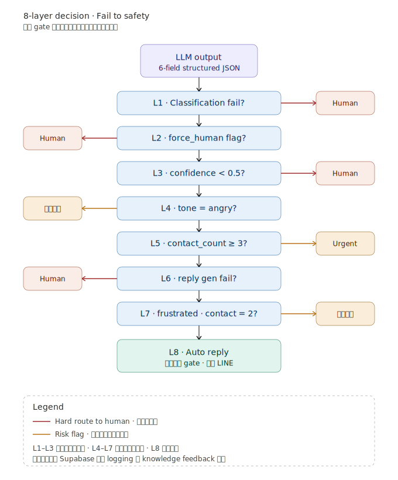

# 02 · 8-Layer Decision Logic

LLM 回傳分類結果後，系統用 8 道 gate 判斷該走哪個出口。設計原則是 **Fail to Safety**：每一道 gate 失敗時預設轉人工，而不是繼續自動。

---

## Diagram

---

## Three Categories

8 道 gate 按職責分成三類：

- **L1–L3 · 能不能自動**：分類成功、非強制人工類別、信心夠高
- **L4–L7 · 該不該自動**：情緒、聯絡次數、技術可行、優先等級
- **L8 · 實際執行**：通過前 7 道 gate 後的最終出口

---

## Gate Details

### L1 · Classification fail?

LLM 回傳的 JSON 不合 schema，或關鍵欄位（intent、confidence）缺失，視為 classification fail，直接轉人工。

**為什麼這道 gate 排第一**：如果連 LLM 回傳都解析不了，後續所有 gate 的判斷都建立在不可靠的資料上。早 fail 早處理，避免下游污染。

### L2 · force_human flag?

LLM 自己判斷這是 contract-related 或 severe complaint 類別時，會在回傳的 6 個 field 中把 `force_human` 設為 true。這類訊息**不論 confidence 多高**都強制轉人工。

**設計理由**：合約相關（運費糾紛、索賠協商）和嚴重客訴（明確的 brand damage 風險）的處理錯誤成本遠高於 LLM 判錯的機率。即使 LLM 高信心覺得能處理，這類 case 也應該由人類接手。

### L3 · confidence < 0.5?

LLM 回傳的 `confidence` 分數低於 0.5 時轉人工。這道 gate 是 **safety net**，處理 LLM 自己也不確定的 case。

**為什麼是 0.5 而非 0.7 或 0.3**：實測下來 0.5 是召回與精度的平衡點。
- 0.7 太嚴：太多正常 case 被擋下來轉人工，反而增加人工負擔
- 0.3 太鬆：低信心 case 走自動，錯誤率上升、客戶體驗變差
- 0.5 + 後續 L4–L7 的風險旗標 = 合理覆蓋

### L4 · tone = angry?

LLM 偵測到客戶語氣是 `angry` 時，加上情緒標記但不強制轉人工。後續路徑會把這個 flag 傳到客服 panel，讓人工能優先處理。

**為什麼不直接轉人工**：angry 客戶通常需要快速回應，而不是排隊等人工。如果其他 gate 都通過，自動回覆 + 情緒標記讓客服可以事後檢視，比讓客戶等 30 分鐘才有人回更好。

### L5 · contact_count ≥ 3?

72 小時內這個客戶聯絡 ≥ 3 次。觸發**緊急升級**到主管 panel。

**為什麼是 3 而非 5**：客戶聯絡 1 次是查詢，2 次是重複問同樣問題（疑似前一次回覆沒解決），3 次代表客戶已經失去耐心。在 3 之前介入還能挽回，到 5 通常已經是奧客等級。

### L6 · reply generation fail?

LLM 回傳的 `suggested_reply` 為空、長度異常、或包含敏感詞時，視為 reply 生成失敗。轉人工。

**為什麼把這道 gate 放在 L4–L5 之後**：reply generation 的失敗率比較低（< 1%），但 L4 / L5 的判斷不需要看 reply 內容，所以放在後面避免 wasted compute。

### L7 · frustrated 或 contact_count = 2?

這道 gate 處理「還沒嚴重但有訊號」的 case：
- `tone = frustrated`：失望但還沒生氣
- `contact_count = 2`：第二次聯絡，可能前一次回覆沒解決問題

觸發**優先旗標**，仍走自動回覆但在客服 panel 標記為「需要 follow up」。

### L8 · 正常自動回覆

通過前 7 道 gate 的 case，把 LLM 的 `suggested_reply` 推送到 LINE。

---

## Output 出口分布

設計時的預期分布（實際數字依 traffic 變動）：

| 出口 | 預期比例 | 觸發條件 |
|---|---|---|
| L8 自動回覆 | ~60% | 通過所有 gate |
| 轉人工（L1, L2, L3, L6） | ~30% | 強制人工類別 |
| 緊急升級（L5） | ~5% | contact ≥ 3 |
| 自動 + 旗標（L4, L7） | ~5% | 風險訊號 |

---

## 為什麼 Fail to Safety？

這個設計來自一個基本判斷：**讓 AI 自動回應錯誤 case 的傷害，遠大於讓 AI 把可自動的 case 轉人工的成本**。

- AI 答錯 → 客戶體驗差、可能升級成客訴、品牌傷害
- AI 該答的轉人工 → 多花一點客服時間、客戶等久一點

這兩種錯誤的成本不對稱，所以 8 道 gate 都選擇「不確定就轉人工」。這跟工管的 poka-yoke（防呆機制）是同一個概念 — 設計階段就把錯誤路徑封掉，比事後修補便宜。

---

## 8 層真的需要嗎？能不能合併？

技術上可以合併成一個複合判斷（confidence < 0.5 OR tone == angry OR ...），但**設計上不應該合併**：

1. **可解釋性**：每道 gate 獨立，當客服問「為什麼這個 case 轉人工？」可以指出具體哪一道。合併後沒辦法 trace。
2. **獨立調整**：confidence threshold、contact count threshold 可能要分別調，分開的 gate 讓我可以單獨改不影響其他。
3. **A/B testing**：可以在某段時間關掉 L4 的 tone gate 看看影響，分開的 gate 才允許這種實驗。

過度合併追求 elegance 是 senior engineer 常犯的錯。對 production system 而言，**可維護性高於程式碼簡潔**。
