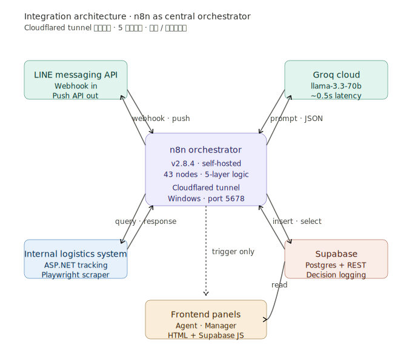

# 03 · Integration Architecture

n8n 在系統中扮演 central orchestrator，連接五個整合點。每個整合點的資料流方向、頻率、failure mode 都不同，這份文件說明每一條連線的設計考量。

---

## Diagram

---

## Five Integration Points

### 1 · LINE Messaging API

**方向**：雙向（webhook inbound + push outbound）

**Inbound**：客戶發訊息時，LINE 透過 webhook 推送事件到 n8n。每個訊息有唯一 `messageId`，用來做 idempotency check（避免 retry 造成重複處理）。

**Outbound**：自動回覆或人工回覆時，n8n 用 LINE Push API 把訊息推給客戶。

**Failure mode**：
- Webhook 到不了 n8n → LINE 會 retry（但 retry 的訊息有相同 messageId，dedup check 會擋掉）
- Push API 失敗 → 退到人工通知 + 客服手動處理

**為什麼用 webhook 不用 polling**：webhook 是 push-based，0 延遲；polling 至少要每 N 秒打一次，浪費資源且增加客戶等待時間。

---

### 2 · Groq Cloud（LLM）

**方向**：雙向 request/response

**Request**：n8n 把組裝好的 prompt 透過 HTTPS POST 送到 Groq。每次呼叫一個獨立 session，不維護對話歷史 — 上下文都包在 prompt 裡。

**Response**：Groq 回傳 JSON，包含 `choices[0].message.content`，裡面是 LLM 生成的 6 欄位 JSON 字串。

**Failure mode**：
- Network timeout → retry 1 次，仍失敗 → 走 L1 (classification fail) → 轉人工
- Rate limit → 等待後 retry
- JSON parse 失敗 → L1 → 轉人工

**為什麼不維護 session 上下文**：客服場景的訊息間隔可能跨小時，把所有歷史塞進 LLM 的 context window 會讓 token cost 爆炸且可能命中 limit。改用 Supabase 查歷史 + 自己組 prompt 的方式，cost 和 control 都更好。

---

### 3 · 內部物流系統

**方向**：n8n 主動查詢

**用途**：用追蹤碼查訂單狀態（配送階段、預計到貨時間、異常記錄），讓 LLM 的回答能基於真實物流資料而非編造。

**實作**：因為內部系統是 ASP.NET 純頁面 POST 介面、沒有 REST API，用 Playwright 寫 scraper 模擬登入和查詢。

**Failure mode**：
- 內網連線異常 → fallback 到不帶物流資料的 prompt（LLM 會回「請提供追蹤碼」之類的通用回覆）
- Scraper 被 detected → 重試或降級

**為什麼用 scraper 而非要 API**：內部 API 開放需要走採購流程，等不及。Scraper 是 pragmatic 的解法 — 雖然脆弱但能立刻 ship。長期應該推動 IT 開 API。

---

### 4 · Supabase

**方向**：雙向 read/write

**Write**：每筆客戶互動的完整紀錄寫入 `decisions` table。schema 包含：
- 訊息原始內容與時間戳
- LLM 6 個 fields
- 走過的 gate 路徑與結果
- 最終出口
- 客服處理結果（如果走人工）

**Read**：
- 查 72 小時內的客戶歷史（聚合上下文用）
- 查 messageId 是否已處理（idempotency）
- 前端管理介面查詢資料

**Failure mode**：
- Write 失敗 → 不阻擋主流程（避免因為 logging 失敗導致客戶收不到回覆），錯誤寫入 dead letter queue 後續補償
- Read 失敗 → fallback 到不帶歷史的 prompt

**為什麼用 Supabase 而非 SQLite / 自建 Postgres**：自帶 REST API + RLS + Auth，省去寫 backend 的工。對 1 人專案的 ROI 高。

---

### 5 · 前端管理介面

**方向**：單向（前端 read Supabase）

**Agent panel v3**：客服人員看到自己負責的客戶 case，可以接手 / 回覆 / 標記完成。

**Manager panel v2**：主管看到所有 case 的聚合 metrics、緊急升級佇列、效能趨勢。

**為什麼前端不透過 n8n 而直接打 Supabase**：減少一層 latency。前端只需要 read，不需要 trigger workflow。Supabase 的 RLS 確保權限隔離。

**前端對 n8n 的關係**：前端會在客服「接手 case」時觸發一個 webhook 到 n8n，讓 n8n 知道這個 case 已被處理（更新 session 狀態）。所以前端對 n8n 是 trigger-only，不依賴 n8n 的 response。

---

## 整合架構的兩個原則

### 原則一 · n8n 是 control plane，不是 data plane

n8n 的職責是「決定發生什麼事」，不是「儲存什麼資料」。所以：
- 客戶歷史在 Supabase，不在 n8n
- 物流資料在內部物流系統，n8n 只是 query
- LLM 推論在 Groq，n8n 只是 forward

n8n 的 state 應該是 stateless 的 — 重啟 n8n 不會丟失任何 production data。

### 原則二 · 每個整合點都要有 failure mode

5 個整合點任一掛掉，整個系統不應該停擺：
- LINE 掛 → 客戶發不了訊息（這是 LINE 的問題不是我們的）
- Groq 掛 → 全部走 L1 fail-safe → 轉人工
- 內部物流系統掛 → fallback 到通用 prompt
- Supabase 掛 → 主流程不阻擋，dead letter queue 補償
- 前端掛 → 不影響後端，只是客服看不到 panel

設計時把 failure mode 列清楚，比追求 happy path 完美重要。
