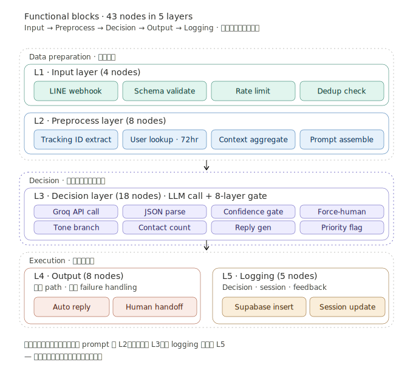

# 04 · Functional Blocks

43 個 n8n 節點按職責切分成五層，每層只依賴上一層的 output。這個切分讓我可以獨立測試 prompt 變更、調整決策門檻、新增 logging 欄位，而不會牽動整個系統。

---

## Diagram

---

## Layer Breakdown

### L1 · Input Layer (4 nodes)

| Node | 職責 |
|---|---|
| LINE webhook | 接收 LINE 推送的訊息事件 |
| Schema validate | 驗證 webhook payload 結構，防止 malformed input |
| Rate limit | 限制單一 userId 的訊息頻率（防 DoS） |
| Dedup check | 用 messageId 在 Supabase 查 24 小時內是否處理過 |

**設計理由**：所有從外部進來的資料都要過 validation 和 rate limit。**邊界檢查放在最前面**，避免污染下游邏輯。

---

### L2 · Preprocess Layer (8 nodes)

| Node | 職責 |
|---|---|
| Tracking ID extract | 用 regex 從訊息文字抓出物流追蹤碼 |
| User lookup by tracking | 用追蹤碼反查客戶 LINE userId |
| Fallback userId join | 沒有追蹤碼時用 LINE userId 直接查歷史 |
| 72hr window | 過濾 72 小時內的歷史訊息 |
| Contact count | 算出 72 小時內聯絡次數 |
| History join | 把歷史訊息聚合成上下文 |
| Prompt assemble | 把所有上下文組裝成 LLM prompt |
| Prompt sanitize | 移除敏感資訊（電話、身分證號） |

**設計理由**：preprocessing 的核心是「把訊息變成 LLM 看得懂的 context」。這層的 quality 直接決定 LLM 的判斷品質。

**為什麼 prompt sanitize 在最後**：所有上下文聚合完才掃描，避免漏網。如果在 extraction 階段做，新增的欄位可能繞過 sanitize。

---

### L3 · Decision Layer (18 nodes) · 系統的核心

| 子分類 | Nodes | 職責 |
|---|---|---|
| LLM 呼叫 | Groq API call, JSON parse, Schema validate | 發推論請求、解析回傳、驗證結構 |
| L1–L3 gate | Classification fail, Force-human, Confidence | 「能不能自動」 |
| L4–L7 gate | Tone branch, Contact count, Reply gen, Priority flag | 「該不該自動」 |
| 收斂節點 | Merge by exit | 把不同 gate 的結果收斂到對應出口 |

**為什麼 18 個節點**：每個 gate 平均需要 2–3 個 n8n 節點實現（IF condition + true/false branches + merge），8 個 gate 加上 LLM 呼叫和 schema validation 自然會到這個數量。

**未來重構方向**：n8n 的 visual 在 gate 太多時反而比 code 難讀。這 18 個節點應該重構成一個 Code node 用 JavaScript 表達決策邏輯，保留 n8n 的 visual 在「跨層的資料流」而非「層內的 if-else」。

---

### L4 · Output Layer (8 nodes)

| 子分類 | Nodes |
|---|---|
| 自動回覆路徑 | Auto LINE reply, Confirm push success, Update auto count |
| 轉人工路徑 | Human handoff notification, Customer wait message, Update queue |
| 緊急升級路徑 | Manager notification, Priority flag, Send escalation alert |

**設計理由**：三條 output path 各自獨立，不共用 node。

**為什麼不共用**：三條路徑的 failure handling 不同：
- 自動回覆失敗 → 降級成轉人工
- 轉人工失敗 → 系統警報 + 人工介入修復
- 緊急升級失敗 → 重試 + 主管 SMS

如果共用節點，failure handling 會混在一起難以維護。

---

### L5 · Logging Layer (5 nodes)

| Node | 職責 |
|---|---|
| Supabase insert decision | 寫入主決策紀錄 |
| Supabase update session | 更新 72 小時 session 狀態 |
| Mark training candidate | 人工處理過的 case 標記為訓練樣本 |
| Trigger frontend refresh | 通知前端 panel 有新資料 |
| Cleanup temp data | 清理 n8n workflow 內的暫存變數 |

**為什麼 logging 在最後而非 LLM 後**：保留完整因果鏈（詳見 [01-overview.md](01-overview.md) 末段）。

---

## 五層切分的工程效益

### 獨立替換

每層只依賴上一層的 output。這代表：

- **改 prompt** 只動 L2 的 `Prompt assemble`，不影響其他層
- **加新 LLM model** 只動 L3 的 `Groq API call`，換成其他 provider
- **改 logging schema** 只動 L5，不影響主流程
- **加新 gate** 在 L3 內部新增節點，不影響 L1, L2, L4, L5

### 獨立測試

每層的輸入輸出都有明確的 JSON schema。這代表我可以：

- 寫 mock data 測 L2 → L3 的 prompt 是否正確
- 用 fixed LLM response 測 L3 的 gate 邏輯
- 用 fixed decision 測 L4 的 output 路由

### 故障隔離

某層出問題時，問題範圍是可預測的：

- L2 出錯 → prompt 品質差 → LLM 結果差 → 但系統不會崩潰
- L3 出錯 → 走 L1 fail-safe → 轉人工
- L5 出錯 → logging 缺失但客戶仍收到回覆

**這是工管的 modularity 概念**。生產線設計時把每個 station 的職責畫清楚，故障時只要修那個 station，不用停整條線。軟體系統一樣。

---

## 為什麼是 5 層而非 3 層或 7 層？

5 層是針對這個 domain 的合理切分：

- **3 層（Input / Process / Output）**：太粗，Decision 跟 Preprocess 混在一起難維護
- **7 層**：例如把 Decision 拆成 LLM call / Classification gate / Routing gate / Action gate — 過度切分，跨層通訊成本超過獲益
- **5 層**：恰好對應系統的天然分界 — 邊界檢查、資料準備、決策、執行、紀錄

設計分層時的判斷標準是：**能不能用一句話說清楚這層做什麼**。如果要說「這層做 A 也做 B」，就該拆；如果兩層說起來像同一件事，就該合。
