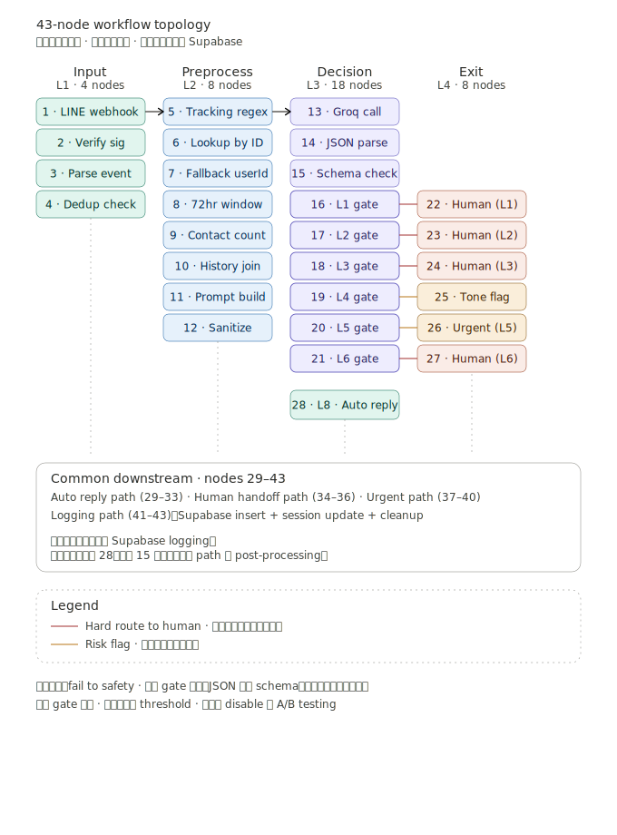

# 05 · Workflow Topology

43 個 n8n 節點的完整連接結構。本文件用結構化 markdown 描述拓撲，不揭露實際的 n8n workflow JSON（內含 webhook URL、credentials reference、internal 欄位名稱）。

---

## Diagram

主圖只畫到 28 號節點（主流程到第一個自動回覆出口）。29–43 號是三個出口路徑各自的 post-processing，下面用文字描述。

---

## Node-by-Node Reference

### Main Flow（1 → 28）

| # | Node | Type | 說明 |
|---|---|---|---|
| 1 | LINE webhook | Webhook | 接收 LINE 推送的 message event |
| 2 | Verify signature | Function | 驗證 LINE 的 X-Line-Signature header |
| 3 | Parse event | Function | 解析 event type（text / image / sticker），只處理 text |
| 4 | Dedup check | Supabase query | messageId 是否已處理過 |
| 5 | Tracking ID regex | Function | 從訊息文字抓追蹤碼 |
| 6 | Lookup by ID | Supabase query | 用追蹤碼查客戶 userId |
| 7 | Fallback userId | Function | 沒追蹤碼時用 LINE userId |
| 8 | 72hr window | Supabase query | 撈 72 小時內歷史 |
| 9 | Contact count | Function | 計算聯絡次數 |
| 10 | History join | Function | 聚合歷史成對話 context |
| 11 | Prompt build | Function | 組 LLM prompt |
| 12 | Prompt sanitize | Function | 移除電話、身分證等敏感資訊 |
| 13 | Groq API call | HTTP request | 呼叫 llama-3.3-70b |
| 14 | JSON parse | Function | 解析 LLM 回傳 |
| 15 | Schema validate | Function | 驗證 6 欄位完整性 |
| 16 | L1 · Classification fail? | IF | gate 1 |
| 17 | L2 · force_human? | IF | gate 2 |
| 18 | L3 · confidence < 0.5? | IF | gate 3 |
| 19 | L4 · tone = angry? | IF | gate 4 |
| 20 | L5 · contact ≥ 3? | IF | gate 5 |
| 21 | L6 · reply gen fail? | IF | gate 6 |
| 22 | 轉人工 (from L1) | Set | 標記 exit type = human |
| 23 | 轉人工 (from L2) | Set | 標記 exit type = human |
| 24 | 轉人工 (from L3) | Set | 標記 exit type = human |
| 25 | 情緒標記 (from L4) | Set | 加 angry flag, 繼續走 |
| 26 | 緊急升級 (from L5) | Set | 標記 exit type = urgent |
| 27 | 轉人工 (from L6) | Set | 標記 exit type = human |
| 28 | L8 · 自動回覆 | Set | 標記 exit type = auto |

---

### Auto Reply Path（28 → 33）

| # | Node | Type | 說明 |
|---|---|---|---|
| 29 | Build LINE reply | Function | 組 LINE Push API payload |
| 30 | Push to LINE | HTTP request | 推送回覆給客戶 |
| 31 | Confirm push | IF | 檢查 push 是否成功 |
| 32 | Increment auto count | Supabase update | 統計自動回覆次數 |
| 33 | Mark resolved | Supabase update | 標記 case 為 resolved |

**Failure handling**：30 號 push 失敗 → 31 號 IF 走 false branch → 降級為轉人工路徑。

---

### Human Handoff Path（22, 23, 24, 27 → 36）

| # | Node | Type | 說明 |
|---|---|---|---|
| 34 | Notify agent panel | Webhook out | 觸發前端 refresh |
| 35 | Send wait message | LINE push | 推「客服稍後回覆」訊息給客戶 |
| 36 | Update queue position | Supabase update | 更新人工佇列 |

**Failure handling**：35 號失敗 → 客戶不會收到等待訊息但 case 仍進佇列，客服還是看得到。

---

### Urgent Escalation Path（26 → 40）

| # | Node | Type | 說明 |
|---|---|---|---|
| 37 | Notify manager panel | Webhook out | 觸發主管 panel refresh |
| 38 | Send manager SMS | HTTP request | 主管手機簡訊（緊急 case） |
| 39 | Send wait message | LINE push | 推安撫訊息給客戶 |
| 40 | Mark high priority | Supabase update | DB 標記 high priority |

**為什麼 SMS 通知主管**：contact_count ≥ 3 通常代表客戶已經失去耐心，等主管下次刷 panel 太慢。SMS 確保 5 分鐘內被看到。

---

### Common Logging Path（最終 3 個節點）

所有路徑（auto / human / urgent）最後都收斂到這三個節點：

| # | Node | Type | 說明 |
|---|---|---|---|
| 41 | Supabase insert decision | Supabase insert | 寫入完整決策紀錄 |
| 42 | Supabase update session | Supabase update | 更新 72hr session state |
| 43 | Cleanup temp vars | Function | 清理 workflow 暫存變數 |

---

## 拓撲特徵

### 主流程 vs 分支

主流程是 1 → 16（垂直貫穿 Input → Preprocess → Decision LLM 呼叫）。從 16 號開始進入 8 個 gate，每個 gate 各自有出口節點，最後在 41 號收斂寫入 Supabase。

**這個設計的好處**：主流程一條直線，異常出口清楚分散在側邊。讀者一眼就能分辨 happy path 與 exception path。

### Failure 收斂點

三條出口路徑（auto / human / urgent）的 failure 都會降級成更安全的路徑：
- Auto reply push 失敗 → 降級成 human handoff
- Human handoff 通知失敗 → 降級成 manager SMS
- Manager SMS 失敗 → 寫入 dead letter queue 由人工巡檢

**Failure 永遠往「人類介入」的方向降級**。這是 Fail to Safety 在拓撲層的體現。

---

## Why This Structure Over Alternatives

### 為什麼不用 single big function？

可以把 16–28 號的 8 個 gate 全部塞進一個 Code node 用 JavaScript 寫。技術上沒問題，但：

- **Visual 失去意義**：n8n 的 value 就是 visual flow，全塞 code 等於用 LangChain
- **非工程同事看不懂**：客服主管要能 review workflow，code 對他們是黑盒子
- **A/B testing 變難**：分開的節點可以個別 disable，code 內部的 if-else 沒辦法

### 為什麼不用 sub-workflow？

n8n 支援 sub-workflow，可以把 8 個 gate 包成一個 sub-workflow 從外面呼叫。但：

- **Debug 變難**：sub-workflow 的執行紀錄要點進去看，主流程看不到完整執行路徑
- **Latency 增加**：每個 sub-workflow 呼叫有 overhead
- **沒有實質的 reuse**：這 8 個 gate 只在這個 workflow 用，packaging 成 sub 沒省到事

當一個結構**只被一個地方使用、沒有 reuse 需求**時，inline 比 abstract 好。這是工程的 YAGNI 原則。

---

## n8n JSON 為什麼不在這個 repo

n8n 的 workflow JSON 包含：

- 實際的 webhook URL（含 cloudflared tunnel host）
- Credentials reference（雖然只是 reference 名稱，但能推測命名規則）
- Internal 物流欄位名稱（內部物流 schema 命名）
- 客戶 ID 樣本（測試資料殘留）

要 sanitize 成可公開版本，工作量大且容易漏。**Markdown 描述能展現完整拓撲**，已足夠 reviewer 評估系統設計能力。

如果 reviewer 要進一步確認實作細節，可在面試時 screen share 看 n8n UI。
